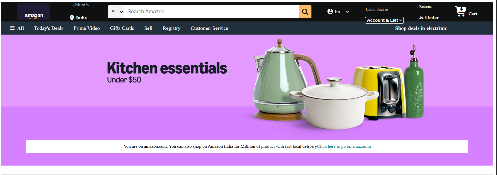
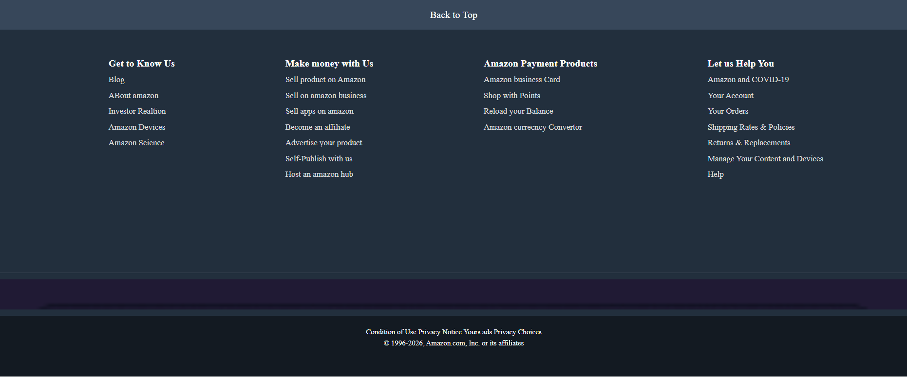

# 🛒 Amazon Clone

A responsive Amazon homepage clone built using **HTML5** and **CSS3**. This project recreates the layout and design of Amazon's landing page to practice modern frontend development concepts such as Flexbox, responsive layouts, hover effects, and clean UI design.

---

## 📸 Preview







> *Replace `preview.png` with a screenshot of your project.*

---

## ✨ Features

* Responsive navigation bar
* Amazon-style search bar
* Delivery location section
* Language selector
* Sign In & Account section
* Shopping cart icon
* Navigation menu
* Hero banner
* Product category cards
* Hover effects
* Multi-column footer
* Clean and organized code

---

## 🛠️ Technologies Used

* HTML5
* CSS3
* Font Awesome Icons

---

## 📁 Project Structure

```
Amazon-Clone/
│
├── index.html
├── style.css
├── README.md
│
└── images/
    ├── logo.png
    ├── hero_image.jpg
    ├── hero_image1.jpg
    ├── hero_image2.jpg
    ├── hero_image3.jpg
    ├── hero_image4.jpg
    └── ...
```

---

## 🚀 Getting Started

### 1. Clone the repository

```bash
git clone https://github.com/your-username/amazon-clone.git
```

### 2. Open the project

```bash
cd amazon-clone
```

### 3. Run the project

Open `index.html` in your browser.

or use VS Code Live Server.

---

## 📷 Screenshots

### Home Page

*Add your screenshots here.*

---

## 🎯 Learning Objectives

This project helped practice:

* HTML semantic elements
* CSS Flexbox
* Responsive layouts
* Hover animations
* Positioning
* Background images
* CSS styling best practices

---

## 📌 Future Improvements

* Responsive mobile design
* JavaScript image slider
* Search functionality
* Product pages
* Login page
* Shopping cart page
* Checkout page
* Dark mode
* Better animations

---

## 🤝 Contributing

Contributions are welcome.

1. Fork the repository
2. Create a feature branch

```bash
git checkout -b feature-name
```

3. Commit your changes

```bash
git commit -m "Add new feature"
```

4. Push to GitHub

```bash
git push origin feature-name
```

5. Open a Pull Request

---

## 👨‍💻 Author

**Kunal Sharma**

* GitHub: https://github.com/Kunal-AZ
* LinkedIn: *(Add your LinkedIn profile)*

---

## ⭐ Support

If you like this project, please consider giving it a ⭐ on GitHub.

---

## 📄 License

This project is created for educational purposes only.

It is **not affiliated with or endorsed by Amazon**. All trademarks and logos belong to their respective owners.
